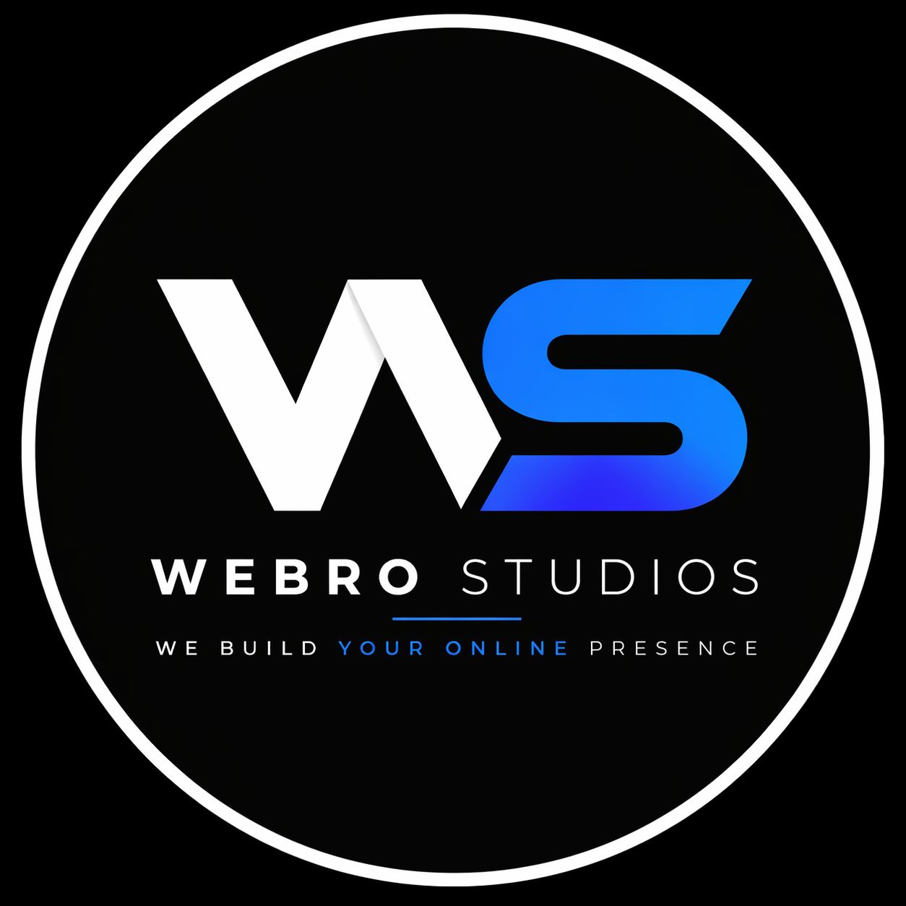

# 🚀 Webro Studios Main

Professional, high-performance web design and development. We build and maintain stunning websites that help businesses grow.



## ✨ Features

- 🏎️ **Blazing Fast**: Optimized performance using Vite and React.
- 📱 **Fully Responsive**: Mobile-first design that looks great on any device.
- 🎨 **Modern Aesthetics**: Built with Shadcn UI and Tailwind CSS for a premium feel.
- ✉️ **Functional Contact Form**: Integrated with Web3Forms for seamless client inquiries.
- 🛠️ **Free Maintenance**: We stand by our work long after launch.

## 🛠️ Tech Stack

- **Framework**: [React](https://reactjs.org/) with [Vite](https://vitejs.dev/)
- **Styling**: [Tailwind CSS](https://tailwindcss.com/)
- **UI Components**: [Shadcn UI](https://ui.shadcn.com/)
- **Animations**: [Framer Motion](https://www.framer.com/motion/)
- **Form Handling**: [Web3Forms](https://web3forms.com/)
- **Icons**: [Lucide React](https://lucide.dev/)

## 🚀 Getting Started

### Prerequisites

- Node.js (v18 or higher)
- npm or bun

### Installation

1. Clone the repository:
   ```bash
   git clone https://github.com/Gauravdeori/webrostudios.git
   ```

2. Install dependencies:
   ```bash
   npm install
   ```

3. Start the development server:
   ```bash
   npm run dev
   ```

## 📧 Contact Us

Feel free to reach out via our contact form or directly through:

- **Email**: webrostudios.in@gmail.com
- **Instagram**: [@webro.studios](https://www.instagram.com/webro.studios)

---

Built with ❤️ by [Webro Studios](https://github.com/Gauravdeori)
